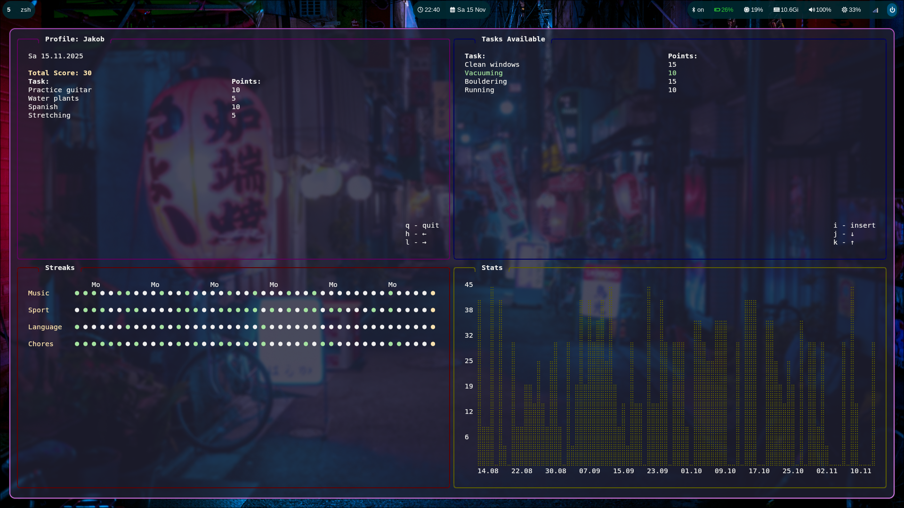

# Gamify Life

Lightweight TUI application for tracking daily tasks and generating statistics and streaks for the done tasks.
- supports custom tasks and streaks
- allows for syncing over a PostgreSQL database
- simple vim-like controls

## Configuration

- with the `--config` flag, a path to a .yaml config file can be specified to override the default configuration settings

### Persistence

- type: the kind of persistence to be used
- for yaml files the type is "yaml"
  - dir: directory to store the files in
- for a local PostgreSQL database the type is "postgres"
  - host: host of the db
  - user: db user
  - db_name: name of the database to use
  - in the scripts folder is a sql script to create the needed tables